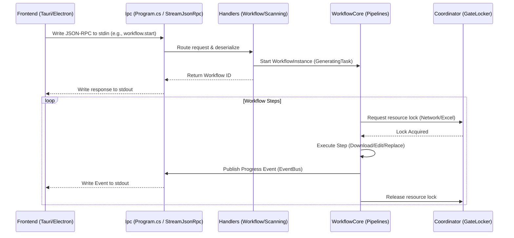

# Architecture & System Design

## The Hook (Q&A)

**Q: How do components interact from Request to Response?**  
A client writes a JSON-RPC payload to `stdin`. `SlideGenerator.Ipc` captures it, routes it to the specific handler (e.g., `WorkflowHandler.StartAsync`), and invokes `WorkflowCore`. The workflow performs the requested task in isolated steps, reporting progress via `WorkflowEventBus`, which pipes data back to `stdout` immediately.

**Q: Why avoid deep abstract layers?**  
Pragmatism. We don't need generic Repositories or CQRS for a sidecar that performs tightly defined file manipulations. Direct injection of scoped Services (like `ScanningService` or `ImageComposer`) reduces boilerplate, makes debugging trivial, and avoids the "spaghetti abstraction" trap.

---

## 1. System Interaction Flow

The following diagram illustrates the exact practical data flow, avoiding theoretical layers.

## 2. Dependency Injection Strategy

Services are registered via local `Registration.cs` files in each module (e.g., `services.AddGeneratingServices()`). We strictly use `Transient` for stateless workers and `Singleton` for caches/locks (like `GateLocker`).

## 3. Error Handling & Stability

- Unhandled exceptions are globally caught in `AppDomain.CurrentDomain.UnhandledException` to log fatal errors before crashing.
- Workflow steps handle domain-specific errors (e.g., a broken image link skips the row rather than crashing the batch).