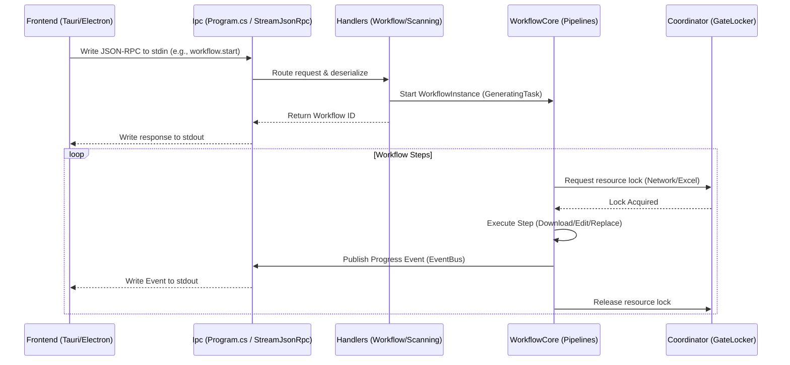

# Kiến trúc & Thiết kế Hệ thống

## The Hook (Q&A)

**Q: Các thành phần tương tác với nhau như thế nào từ lúc nhận Request đến lúc trả về Response?**  
Client ghi một payload JSON-RPC vào `stdin`. `SlideGenerator.Ipc` bắt lấy, định tuyến nó đến handler tương ứng (vd: `WorkflowHandler.StartAsync`), và kích hoạt `WorkflowCore`. Workflow thực thi tác vụ qua các bước độc lập, báo cáo tiến độ qua `WorkflowEventBus`, và đẩy dữ liệu về lại `stdout` ngay lập tức.

**Q: Tại sao lại bỏ qua các tầng logic trừu tượng sâu?**  
Tính thực dụng. Chúng ta không cần Repository dùng chung hay CQRS cho một sidecar chỉ thực hiện các thao tác file đã được định nghĩa chặt chẽ. Việc inject trực tiếp các Service theo scope (như `ScanningService` hay `ImageComposer`) giúp giảm code thừa, dễ dàng debug, và tránh cái bẫy "trừu tượng hóa như mì spaghetti".

---

## 1. Luồng tương tác hệ thống

Sơ đồ dưới đây minh họa luồng dữ liệu thực tế và chính xác, loại bỏ các tầng lý thuyết.

## 2. Chiến lược Dependency Injection

Các service được đăng ký thông qua các file `Registration.cs` nội bộ trong từng module (vd: `services.AddGeneratingServices()`). Chúng ta tuân thủ nghiêm ngặt việc dùng `Transient` cho các worker không lưu trạng thái và `Singleton` cho bộ nhớ đệm/khóa (như `GateLocker`).

## 3. Xử lý Lỗi & Độ ổn định

- Các ngoại lệ không được xử lý (unhandled exceptions) sẽ bị bắt ở cấp toàn cục tại `AppDomain.CurrentDomain.UnhandledException` để ghi log lỗi nghiêm trọng trước khi ứng dụng crash.
- Các bước trong workflow tự xử lý lỗi đặc thù (vd: một link ảnh bị hỏng sẽ bỏ qua dòng dữ liệu đó thay vì làm sập toàn bộ tiến trình).