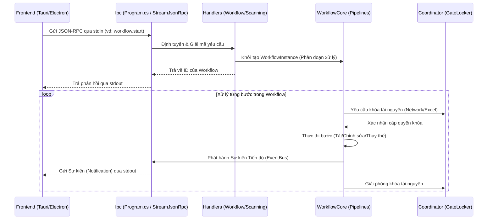

# Kiến trúc & Thiết kế Hệ thống (Architecture)

Dự án áp dụng mô hình kiến trúc **Modular Monolith** kết hợp với **IPC Sidecar**. Thay vì phức tạp hóa bằng Microservices hay các lớp Repository nặng nề, hệ thống hoạt động như một tiến trình phụ (sidecar) giao tiếp trực tiếp với Frontend (như Tauri hoặc Electron) thông qua luồng I/O tiêu chuẩn (`stdin/stdout`).

## 1. Triết lý thiết kế (The Hook Q&A)

**Q: Các thành phần tương tác với nhau như thế nào từ lúc nhận Request đến lúc trả về Response?**  
Client ghi một payload JSON-RPC vào `stdin`. `SlideGenerator.Ipc` bắt lấy, định tuyến nó đến handler tương ứng (vd: `WorkflowHandler.StartAsync`), và kích hoạt `WorkflowCore`. Workflow thực thi tác vụ qua các bước độc lập, báo cáo tiến độ qua `WorkflowEventBus`, và đẩy dữ liệu về lại `stdout` ngay lập tức.

**Q: Tại sao lại bỏ qua các tầng logic trừu tượng sâu?**  
Tính thực dụng. Chúng ta không cần Repository dùng chung hay CQRS cho một sidecar chỉ thực hiện các thao tác file đã được định nghĩa chặt chẽ. Việc inject trực tiếp các Service theo scope (như `ScanningService` hay `ImageComposer`) giúp giảm code thừa, dễ dàng debug, và tránh cái bẫy "trừu tượng hóa như mì spaghetti".

---

## 2. Luồng tương tác hệ thống (Data Flow)

Sơ đồ dưới đây minh họa luồng dữ liệu thực tế và chính xác:

## 3. Cấu trúc các Lớp/Mô-đun (Module Hierarchy)

Hệ thống được chia thành các mô-đun độc lập với quy tắc phụ thuộc một chiều (từ trên xuống dưới):

1. **Foundation Modules (Nền tảng):** Không có phụ thuộc bên ngoài.
   - `SlideGenerator.Settings`: Quản lý cấu hình dựa trên YAML.
   - `SlideGenerator.Cloud`: Phân giải liên kết đa đám mây.
2. **Core Services (Dịch vụ Lõi):** Phụ thuộc vào Settings. Cung cấp các khả năng dùng chung.
   - `SlideGenerator.Coordinator`: Kiểm soát đồng thời (`GateLocker`).
   - `SlideGenerator.Download`: Tải tệp HTTP với khả năng giới hạn tốc độ và báo cáo tiến độ.
   - `SlideGenerator.Documents`: Thao tác với Excel/PowerPoint qua thư viện Syncfusion.
3. **Feature Modules (Tính năng):** Các hoạt động nghiệp vụ cụ thể.
   - `SlideGenerator.Images`: Xử lý hình ảnh bằng `MagickImage`, phát hiện ROI và khuôn mặt bằng OpenCV (YuNet).
   - `SlideGenerator.Logging`: Ghi log hệ thống và quy trình (Serilog xuống file và DB).
4. **Orchestration & Entry Point (Điều phối):**
   - `SlideGenerator.Pipelines`: Quản lý luồng công việc (Scanning & Generating) thông qua **WorkflowCore**.
   - `SlideGenerator.Ipc`: Điểm vào (Entry point), xử lý JSON-RPC 2.0.

## 4. Chiến lược Dependency Injection

Các service được đăng ký thông qua các file `Registration.cs` nội bộ trong từng module (vd: `services.AddGeneratingServices()`). Chúng ta tuân thủ nghiêm ngặt việc dùng `Transient` cho các worker không lưu trạng thái và `Singleton` cho bộ nhớ đệm/khóa (như `GateLocker`).

## 5. Xử lý Lỗi & Độ ổn định

- Các ngoại lệ không được xử lý (unhandled exceptions) sẽ bị bắt ở cấp toàn cục tại `AppDomain.CurrentDomain.UnhandledException` để ghi log lỗi nghiêm trọng trước khi ứng dụng crash.
- Các bước trong workflow tự xử lý lỗi đặc thù (vd: một link ảnh bị hỏng sẽ bỏ qua dòng dữ liệu đó thay vì làm sập toàn bộ tiến trình).
