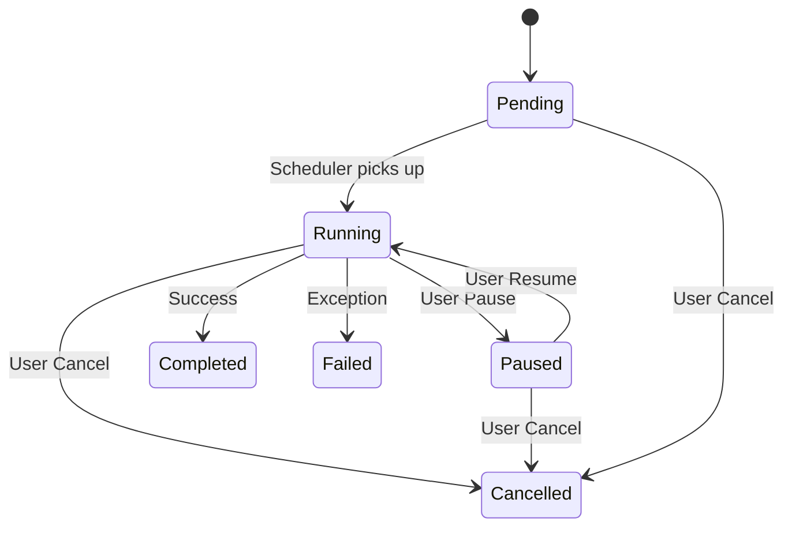

# Job System

[🇻🇳 Vietnamese Version](../vi/job-system.md)

The Job System is the core engine of SlideGenerator, responsible for managing the lifecycle of slide generation tasks. It supports grouping, pause/resume/cancel control, and crash recovery from SQLite checkpoints.

## Concepts

### Job Hierarchy

The runtime executes a 3-level hierarchy:

1. **Book Job**
    - Root request scope.
    - Validates config/input and prepares output files.
2. **Sheet Job**
    - One worksheet mapped to one output presentation.
    - Expands template slide by row count.
3. **Row Job**
    - One record processing unit.
    - Resolves text/image replacement with column priority.

### Job States

A job transitions through the following states:

- **Pending:** Queued and waiting for execution resources.
- **Running:** Currently executing.
- **Paused:** Temporarily stopped by the user. State is preserved.
- **Completed:** Successfully completed.
- **Cancelled:** Stopped by user request.
- **Failed:** Failed due to an exception.

### State Diagram

## Persistence & Recovery

Job state is persisted in SQLite:

- `jobs`: root job status and serialized request payload.
- `job_sheets`: per-sheet checkpoint (`current_row`, `total_rows`, status, output path).
- `job_rows`: per-row status and idempotency key.

### Crash Recovery
The system is designed to be resilient.
- **State Saving:** status/progress updates are flushed during execution.
- **Recovery:** on startup, pending/running jobs are re-enqueued.
- **Idempotency:** row-level idempotency keys provide best-effort exactly-once behavior.

## Workflow

### 1. Creation (`JobCreate`)
- User submits a request via JSON-RPC (`jobs.create`).
- Runtime validates template/data paths and writes initial job/sheet rows.
- Job enters `Pending` and is pushed to runtime queue.

### 2. Execution
- Runtime worker picks queued jobs and executes `Book -> Sheet -> Row`.
- **Concurrency Control:** bounded by configured semaphores (book and sheet level).
- **Resume Strategy:** paused jobs return to queue on `jobs.resume`.

### 3. Processing
- **Step 1:** Load Template & Data.
- **Step 2:** Process Replacements (Text & Images).
- **Step 3:** Render Slide.
- **Step 4:** Save to Output Path.

#### LoadWorkbooks Activity (Step 1)

- **Input (`Workbooks`)**: `ICollection<WorkbookIdentifier>` containing workbook file paths.
- **Workflow shape**: `Sequence` -> `InitializeRegistry` -> `ParallelForEach<WorkbookIdentifier>`.
- **Parallel iteration item**: inside `Body`, Elsa exposes the current item via variable `"CurrentValue"`.
- **Transient state**: opened workbooks are stored in `WorkflowExecutionContext.TransientProperties["Workbooks"]` as a concurrent dictionary.
- **Skip behavior**: null item, empty path, and non-existing file paths are ignored.
- **Registry key**: workbook internal name (`XLWorkbook.GetName()`), fallback to file name without extension.

### 4. Completion
- Each finished row updates checkpoint and progress.
- A sheet becomes `Completed` when all rows are done.
- A book becomes `Completed` when all mapped sheets are done.

## Concurrency Model

- **Limit:** Defined by `job.maxConcurrentJobs` in `backend.config.yaml`.
- **Scope:** limits top-level book execution; sheet concurrency is additionally bounded inside a book.

Next: [Stdio JSON-RPC API](stdio-jsonrpc.md)
