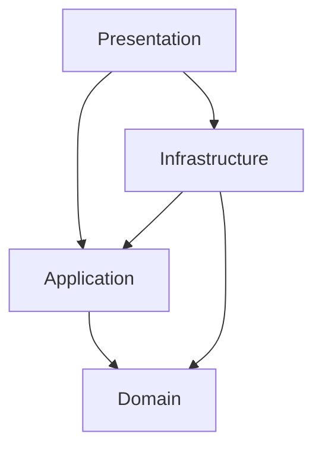

# Architecture

[🇻🇳 Vietnamese Version](../vi/architecture.md)

## Overview

The backend is built on the principles of **Clean Architecture**, ensuring a strict separation of concerns. This design allows the core business logic to remain independent of frameworks, databases, and external interfaces.

## Layered Architecture

The solution is divided into four concentric layers:

### 1. Domain Layer (`SlideGenerator.Domain`)
**The Core.** Contains the enterprise business rules and entities.
- **Dependencies:** None.
- **Components:**
    - `Entities`: Core objects like `JobGroup`, `JobSheet`.
    - `Enums`: `JobStatus`, `JobType`.
    - `ValueObjects`: Immutable descriptors.
    - `Constants`: System-wide invariants.

### 2. Application Layer (`SlideGenerator.Application`)
**The Orchestrator.** Contains application-specific business rules.
- **Dependencies:** Domain.
- **Components:**
    - `Interfaces`: Contracts for Infrastructure (e.g., `IJobStore`, `IFileService`).
    - `DTOs`: Data Transfer Objects for API communication.
    - `Services`: Business logic services (e.g., `JobManager`).
    - `Features`: CQRS-style handlers (if applicable).

### 3. Infrastructure Layer (`SlideGenerator.Infrastructure`)
**The Adapter.** Implements interfaces defined in the Application layer.
- **Dependencies:** Application, Domain.
- **Components:**
    - `Hangfire`: Background job processing and state persistence.
    - `SQLite`: Physical data storage implementation.
    - `FileSystem`: IO operations (reading/writing files).
    - `Logging`: Serilog integration.

### 4. Presentation Layer (`SlideGenerator.Presentation`)
**The Entry Point.** The interface through which users interact with the system.
- **Dependencies:** Application, Infrastructure.
- **Components:**
    - `ASP.NET Core`: Web Host configuration.
    - `SignalR Hubs`: Real-time API endpoints (`JobHub`, `ConfigHub`).
    - `Program.cs`: Dependency Injection (DI) composition root.

## Key Runtime Components

### Job Execution Flow

1.  **Request:** `TaskHub` receives a `JobCreate` request (JSON) from the client.
2.  **Orchestration:** `JobManager` (Application) validates the request and creates a `JobGroup` (Domain).
3.  **Persistence:** `ActiveJobCollection` delegates to `HangfireJobStateStore` (Infrastructure) to save the initial state.
4.  **Execution:** `Hangfire` (Infrastructure) picks up the job.
5.  **Processing:** `JobExecutor` (Application/Infrastructure) performs the slide generation using the Framework.
6.  **Notification:** `JobNotifier` (Infrastructure) pushes updates back to the client via `SignalR`.

Next: [SignalR API](signalr.md)
