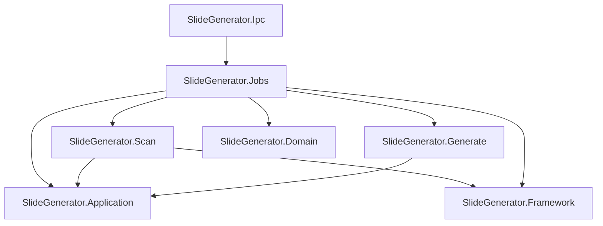

# Architecture

[🇻🇳 Vietnamese Version](../vi/architecture.md)

## Overview

The backend is organized in a **feature-based** style for simpler ownership and faster iteration.  
Instead of enforcing strict clean-architecture rings, each project owns one runtime feature while reusing shared contracts from `SlideGenerator.Application` and domain models from `SlideGenerator.Domain`.

## Project Layout

```mermaid
graph TD
    Ipc[SlideGenerator.Ipc] --> JobRuntime[SlideGenerator.Jobs]
    JobRuntime --> Scan[SlideGenerator.Scan]
    JobRuntime --> Generate[SlideGenerator.Generate]
    JobRuntime --> App[SlideGenerator.Application]
    Scan --> App
    Generate --> App
    JobRuntime --> Domain[SlideGenerator.Domain]
    Scan --> Framework[SlideGenerator.Framework]
    JobRuntime --> Framework
```

### `SlideGenerator.Ipc`
- JSON-RPC host over stdio (`StreamJsonRpc`).
- Exposes methods: `system.health`, `slides.scan`, `excel.scan`, `jobs.*`.
- Emits `jobs.updated` notifications.

### `SlideGenerator.Scan`
- Scan workflows for PPTX and Excel metadata.
- Returns DTO-compatible payloads (`SlideScanResult`, `SheetScanResult`).

### `SlideGenerator.Generate`
- Generate request validation and mapping logic.
- Encapsulates feature-specific generation helpers.

### `SlideGenerator.Jobs`
- Main runtime orchestration for create/list/get/control jobs.
- Queue + concurrency control + pause/resume/cancel.
- SQLite persistence for job/sheet/row state and recovery.

### Shared Projects
- `SlideGenerator.Application`: DTO/contracts and backend service interface.
- `SlideGenerator.Domain`: job snapshots/status models.
- `SlideGenerator.Framework`: low-level slide/image capabilities (unchanged by backend rewrite).

## Runtime Flow

1. `Ipc` receives JSON-RPC request.
2. `JobRuntime` validates and persists initial job state to SQLite.
3. Runtime enqueues work with bounded concurrency.
4. Per sheet/row processing executes and checkpoints progress.
5. Runtime publishes `jobs.updated` snapshots back to client.

Next: [Stdio JSON-RPC API](stdio-jsonrpc.md)
