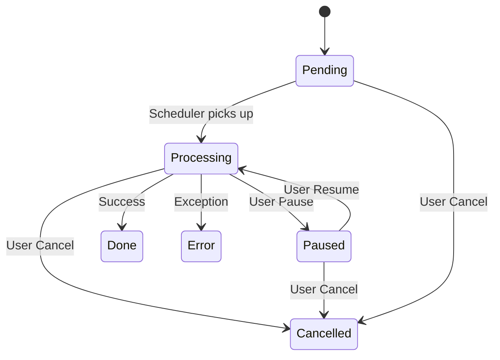

# Job System

[🇻🇳 Vietnamese Version](../vi/job-system.md)

The Job System is the core engine of SlideGenerator, responsible for managing the lifecycle of slide generation tasks. It supports complex workflows including grouping, pausing, resuming, and crash recovery.

## Concepts

### Job Hierarchy

The system uses a composite pattern to manage jobs:

1.  **Group Job (`JobGroup`)**: The root container. Represents a single user request (one Workbook + one Template).
    *   Contains multiple **Sheet Jobs**.
    *   Manages shared resources (template parsing, output folder).
2.  **Sheet Job (`JobSheet`)**: The atomic unit of work. Represents the generation of one output file from one worksheet.

### Job States

A job transitions through the following states:

- **Pending:** Queued and waiting for execution resources.
- **Processing:** Currently running (parsing data or generating slides).
- **Paused:** Temporarily stopped by the user. State is preserved.
- **Done:** Successfully completed.
- **Cancelled:** Stopped by user request.
- **Error:** Failed due to an exception.

### State Diagram

## Collections & Persistence

The `JobManager` orchestrates jobs across two primary collections:

1.  **Active Collection:**
    *   **Storage:** In-memory `ConcurrentDictionary`.
    *   **Contents:** Jobs that are `Pending`, `Processing`, or `Paused`.
    *   **Persistence:** State is continuously synced to SQLite via `HangfireJobStateStore`.
2.  **Completed Collection:**
    *   **Storage:** In-memory (cached) + SQLite (archived).
    *   **Contents:** Jobs that are `Done`, `Failed`, or `Cancelled`.

### Crash Recovery
The system is designed to be resilient.
- **State Saving:** Every state change and progress update is written to the local SQLite database.
- **Recovery:** On application restart, the system loads unfinished jobs from the database.
    - Jobs that were `Processing` are demoted to `Paused` to prevent immediate resource contention.
    - `Pending` jobs remain `Pending`.

## Workflow

### 1. Creation (`JobCreate`)
- User submits a request via SignalR.
- System creates a `JobGroup` and analyzes the Excel workbook to create child `JobSheet`s.
- The Group is added to the **Active Collection**.

### 2. Execution
- If `AutoStart` is enabled, jobs are enqueued to Hangfire.
- **Concurrency Control:** The system respects `job.maxConcurrentJobs` configuration to limit parallel processing.
- **Resume Strategy:** When resuming, the system prioritizes filling available slots with paused jobs before starting new pending ones.

### 3. Processing
- **Step 1:** Load Template & Data.
- **Step 2:** Process Replacements (Text & Images).
- **Step 3:** Render Slide.
- **Step 4:** Save to Output Path.

### 4. Completion
- When a `JobSheet` finishes, it updates its status.
- When **all** `JobSheet`s in a `JobGroup` are finished, the Group transitions to `Completed` and is moved to the **Completed Collection**.

## Concurrency Model

- **Limit:** Defined by `job.maxConcurrentJobs` in `backend.config.yaml`.
- **Scope:** Limits the number of *Sheet Jobs* running simultaneously, not Groups. A single Group with 10 sheets can consume all available slots.

Next: [SignalR API](signalr.md)
