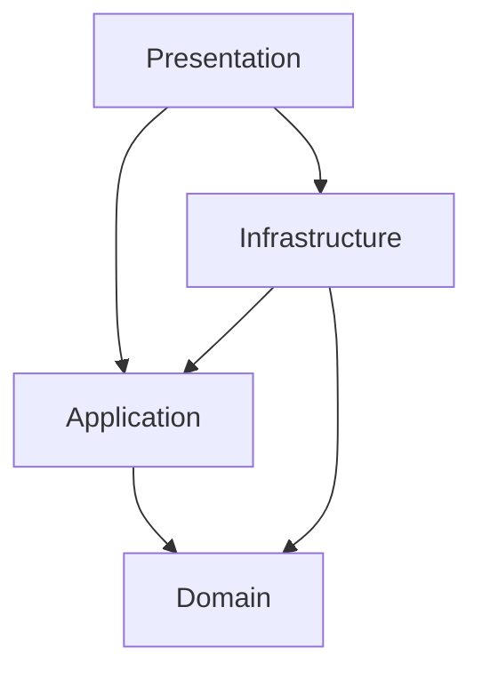

# Kiến trúc Hệ thống

[🇺🇸 English Version](../en/architecture.md)

## Tổng quan

Backend được xây dựng dựa trên nguyên lý **Clean Architecture** (Kiến trúc Sạch), đảm bảo sự phân tách rõ ràng giữa các mối quan tâm (separation of concerns). Thiết kế này cho phép logic nghiệp vụ cốt lõi độc lập hoàn toàn với các framework, cơ sở dữ liệu và giao diện bên ngoài.

## Kiến trúc Phân tầng

Giải pháp được chia thành bốn tầng đồng tâm:

### 1. Tầng Domain (`SlideGenerator.Domain`)
**Cốt lõi.** Chứa các quy tắc nghiệp vụ và thực thể doanh nghiệp.
- **Phụ thuộc:** Không có.
- **Thành phần:**
    - `Entities`: Các đối tượng cốt lõi như `JobGroup`, `JobSheet`.
    - `Enums`: `JobStatus`, `JobType`.
    - `ValueObjects`: Các định danh bất biến.
    - `Constants`: Các hằng số bất biến của hệ thống.

### 2. Tầng Application (`SlideGenerator.Application`)
**Người điều phối.** Chứa các quy tắc nghiệp vụ đặc thù của ứng dụng.
- **Phụ thuộc:** Domain.
- **Thành phần:**
    - `Interfaces`: Hợp đồng giao tiếp cho tầng Infrastructure (ví dụ: `IJobStore`, `IFileService`).
    - `DTOs`: Đối tượng chuyển dữ liệu dùng cho giao tiếp API.
    - `Services`: Các dịch vụ logic nghiệp vụ (ví dụ: `JobManager`).
    - `Features`: Các bộ xử lý theo phong cách CQRS (nếu áp dụng).

### 3. Tầng Infrastructure (`SlideGenerator.Infrastructure`)
**Bộ chuyển đổi.** Triển khai các interface được định nghĩa ở tầng Application.
- **Phụ thuộc:** Application, Domain.
- **Thành phần:**
    - `Hangfire`: Xử lý công việc nền và lưu trữ trạng thái.
    - `SQLite`: Triển khai lưu trữ dữ liệu vật lý.
    - `FileSystem`: Các thao tác I/O (đọc/ghi file).
    - `Logging`: Tích hợp Serilog.

### 4. Tầng Presentation (`SlideGenerator.Presentation`)
**Điểm nhập.** Giao diện để người dùng tương tác với hệ thống.
- **Phụ thuộc:** Application, Infrastructure.
- **Thành phần:**
    - `ASP.NET Core`: Cấu hình Web Host.
    - `SignalR Hubs`: Các endpoint API thời gian thực (`JobHub`, `ConfigHub`).
    - `Program.cs`: Root (gốc) để cấu hình Dependency Injection (DI).

## Các thành phần Runtime chính

### Luồng thực thi Job

1.  **Yêu cầu:** `TaskHub` nhận một yêu cầu `JobCreate` (JSON) từ client.
2.  **Điều phối:** `JobManager` (Application) xác thực yêu cầu và tạo một `JobGroup` (Domain).
3.  **Lưu trữ:** `ActiveJobCollection` ủy quyền cho `HangfireJobStateStore` (Infrastructure) để lưu trạng thái ban đầu.
4.  **Thực thi:** `Hangfire` (Infrastructure) nhận job để xử lý.
5.  **Xử lý:** `JobExecutor` (Application/Infrastructure) thực hiện việc tạo slide sử dụng Framework.
6.  **Thông báo:** `JobNotifier` (Infrastructure) đẩy cập nhật trạng thái về client thông qua `SignalR`.

Tiếp theo: [SignalR API](signalr.md)
