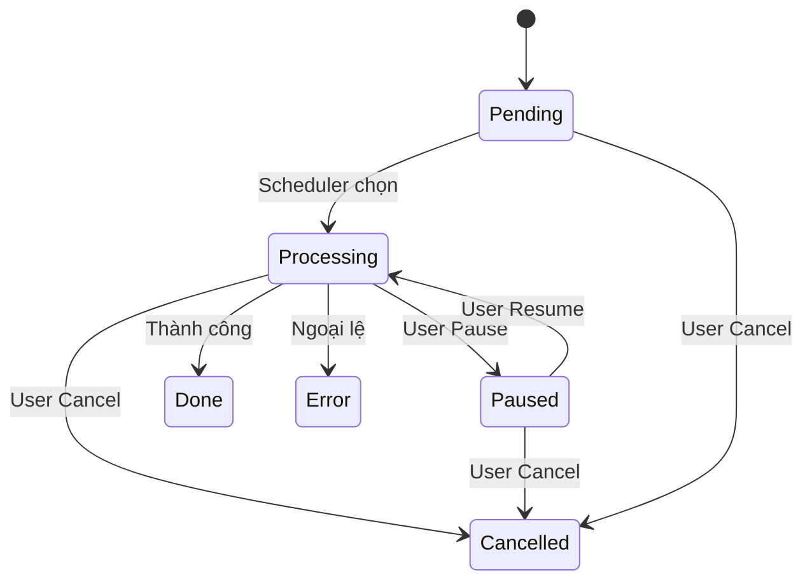

# Hệ thống Job

[🇺🇸 English Version](../en/job-system.md)

Hệ thống Job là động cơ cốt lõi của SlideGenerator, chịu trách nhiệm quản lý vòng đời của các tác vụ tạo slide. Nó hỗ trợ các quy trình phức tạp bao gồm gom nhóm (grouping), tạm dừng, tiếp tục và khôi phục sau sự cố.

## Các khái niệm

### Phân cấp Job

Hệ thống sử dụng mẫu Composite để quản lý các job:

1.  **Group Job (`JobGroup`)**: Container gốc. Đại diện cho một yêu cầu từ người dùng (một Workbook + một Template).
    *   Chứa nhiều **Sheet Jobs**.
    *   Quản lý tài nguyên chung (parse template, thư mục đầu ra).
2.  **Sheet Job (`JobSheet`)**: Đơn vị công việc nhỏ nhất. Đại diện cho việc tạo ra một file đầu ra từ một worksheet.

### Trạng thái Job

Một job chuyển đổi qua các trạng thái sau:

- **Pending (Chờ):** Đang xếp hàng chờ tài nguyên thực thi.
- **Processing (Đang xử lý):** Đang chạy (đọc dữ liệu hoặc render slide).
- **Paused (Tạm dừng):** Người dùng tạm dừng. Trạng thái được bảo lưu.
- **Done (Hoàn thành):** Kết thúc thành công.
- **Cancelled (Đã hủy):** Người dùng yêu cầu dừng.
- **Error (Lỗi):** Thất bại do có ngoại lệ (exception).

### Sơ đồ Trạng thái

## Bộ sưu tập & Lưu trữ

`JobManager` điều phối job thông qua hai bộ sưu tập (collection) chính:

1.  **Active Collection (Đang hoạt động):**
    *   **Lưu trữ:** In-memory `ConcurrentDictionary`.
    *   **Nội dung:** Các job đang `Pending`, `Processing`, hoặc `Paused`.
    *   **Bền vững:** Trạng thái được đồng bộ liên tục xuống SQLite qua `HangfireJobStateStore`.
2.  **Completed Collection (Đã hoàn thành):**
    *   **Lưu trữ:** In-memory (cache) + SQLite (lưu trữ lâu dài).
    *   **Nội dung:** Các job đã `Done`, `Failed`, hoặc `Cancelled`.

### Khôi phục sự cố (Crash Recovery)
Hệ thống được thiết kế để có khả năng phục hồi cao.
- **Lưu trạng thái:** Mọi thay đổi trạng thái và cập nhật tiến độ đều được ghi xuống cơ sở dữ liệu SQLite cục bộ.
- **Khôi phục:** Khi ứng dụng khởi động lại, hệ thống sẽ tải các job chưa hoàn thành từ database.
    - Các job đang `Processing` sẽ bị chuyển về `Paused` để tránh tranh chấp tài nguyên ngay lập tức.
    - Các job `Pending` vẫn giữ nguyên là `Pending`.

## Quy trình làm việc (Workflow)

### 1. Khởi tạo (`JobCreate`)
- Người dùng gửi yêu cầu qua SignalR.
- Hệ thống tạo `JobGroup` và phân tích Excel workbook để tạo các `JobSheet` con.
- Group được thêm vào **Active Collection**.

### 2. Thực thi
- Nếu `AutoStart` được bật, các job sẽ được đẩy vào hàng đợi Hangfire.
- **Kiểm soát đồng thời:** Hệ thống tuân thủ cấu hình `job.maxConcurrentJobs` để giới hạn số lượng xử lý song song.
- **Chiến lược Resume:** Khi tiếp tục, hệ thống ưu tiên điền vào các slot trống bằng các job đang tạm dừng trước khi bắt đầu job mới đang chờ.

### 3. Xử lý (Processing)
- **Bước 1:** Tải Template & Dữ liệu.
- **Bước 2:** Xử lý thay thế (Text & Ảnh).
- **Bước 3:** Render Slide.
- **Bước 4:** Lưu xuống đường dẫn đầu ra.

### 4. Hoàn tất
- Khi một `JobSheet` xong, nó cập nhật trạng thái của mình.
- Khi **tất cả** `JobSheet` trong một `JobGroup` xong, Group chuyển sang trạng thái `Completed` và được di chuyển sang **Completed Collection**.

## Mô hình Đồng thời

- **Giới hạn:** Được định nghĩa bởi `job.maxConcurrentJobs` trong `backend.config.yaml`.
- **Phạm vi:** Giới hạn số lượng *Sheet Jobs* chạy đồng thời, không phải Groups. Một Group đơn lẻ với 10 sheet có thể chiếm dụng toàn bộ các slot xử lý.

Tiếp theo: [SignalR API](signalr.md)

