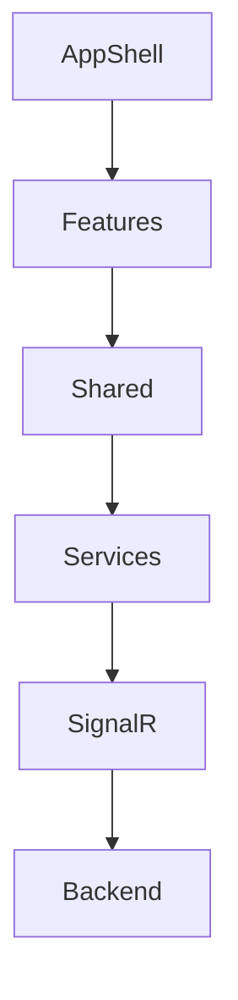

# Frontend Architecture

[🇻🇳 Vietnamese Version](../vi/overview.md)

## Purpose

The SlideGenerator Frontend is a specialized desktop application designed to:
1.  Provide a wizard-like interface for configuring complex slide generation jobs.
2.  Offer real-time monitoring of background processes.
3.  Manage local application settings and themes.

**Key Principle:** The Frontend is "Thin". It holds minimal business logic. The Backend is the source of truth for all job states. The UI simply reflects the state received via SignalR.

## High-Level Architecture

The application follows a Feature-based folder structure, ensuring scalability and maintainability.

### 1. Application Layer (`src/app`)
Responsible for the app's lifecycle and global context.
- **Routing:** Manages navigation between tabs (Create, Process, Results).
- **Providers:** Wraps the app with `ThemeProvider`, `ToastProvider`, etc.
- **Layout:** Defines the standard window frame (Sidebar, TitleBar).

### 2. Feature Layer (`src/features`)
Contains the UI logic for specific user workflows.
- **`create-task`**: Multi-step form for job inputs.
- **`process`**: Dashboard showing progress bars and status indicators.
- **`results`**: List of completed jobs with file actions (Open, Explorer).
- **`settings`**: Configuration UI for backend and app preferences.

### 3. Shared Layer (`src/shared`)
Reusable components and utilities.
- **`components`**: Generic UI elements (Buttons, Inputs, Modals).
- **`contexts`**: Global state containers (`AppContext`, `JobContext`).
- **`services`**: API clients and SignalR integration.

## Communication Layer

### SignalR Client
Located in `src/shared/services/signalr/`.
- **Auto-reconnect:** Automatically handles connection drops.
- **Queueing:** Buffers requests if the connection is temporarily lost.
- **Typed Events:** Strongly typed listeners for `GroupProgress`, `JobStatus`, etc.

### API Facade
Located in `src/shared/services/backend/`.
- Provides a clean, Promise-based API for interacting with the backend.
- Wraps SignalR calls to abstract the underlying transport.

## Data Flow

1.  **User Action:** User clicks "Start Job" in the `create-task` feature.
2.  **Service Call:** Component calls `BackendService.createJob()`.
3.  **Transmission:** Request is sent via SignalR WebSocket.
4.  **Backend Processing:** Backend creates the job and returns an ID.
5.  **Notification:** Backend pushes a `JobStatus` event (Pending).
6.  **Update:** `JobContext` receives the event and updates the global state.
7.  **Re-render:** `process` feature re-renders to show the new job in the list.

## Performance Strategies

- **Virtualization:** (Planned) For efficiently rendering large lists of jobs.
- **Memoization:** `React.memo` and `useMemo` are aggressively used in `JobItem` components to prevent unnecessary re-renders during rapid progress updates.
- **Log Trimming:** The in-memory log buffer is capped (default 2500 lines) to prevent memory leaks in long-running sessions.

## Storage

We use `localStorage` and `sessionStorage` for non-critical persistence:

| Key | Storage | Description |
| :--- | :--- | :--- |
| `slidegen.backend.url` | Local | The active Backend URL. |
| `slidegen.theme` | Local | UI Theme preference (Dark/Light). |
| `slidegen.ui.inputsideBar.state` | Session | Draft state of the Create Task form. |

Next: [Development Guide](development.md)
