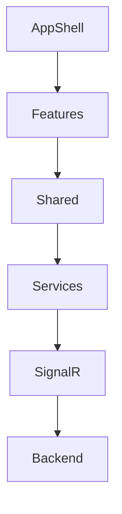

# Kiến trúc Frontend

[🇺🇸 English Version](../en/overview.md)

## Mục đích

Frontend của SlideGenerator là một ứng dụng desktop chuyên biệt được thiết kế để:
1.  Cung cấp giao diện dạng wizard để cấu hình các job tạo slide phức tạp.
2.  Cung cấp khả năng giám sát thời gian thực các tiến trình nền.
3.  Quản lý các cài đặt ứng dụng cục bộ và giao diện (theme).

**Nguyên lý cốt lõi:** Frontend là dạng "Thin Client". Nó chứa rất ít logic nghiệp vụ. Backend mới là nơi chứa sự thật (source of truth) cho mọi trạng thái job. Giao diện chỉ phản ánh trạng thái nhận được qua SignalR.

## Kiến trúc Mức cao

Ứng dụng tuân theo cấu trúc thư mục dựa trên Tính năng (Feature-based), đảm bảo khả năng mở rộng và bảo trì.

### 1. Tầng Ứng dụng (`src/app`)
Chịu trách nhiệm về vòng đời ứng dụng và context toàn cục.
- **Routing:** Quản lý điều hướng giữa các tab (Create, Process, Results).
- **Providers:** Bọc ứng dụng với `ThemeProvider`, `ToastProvider`, v.v.
- **Layout:** Định nghĩa khung cửa sổ tiêu chuẩn (Sidebar, TitleBar).

### 2. Tầng Tính năng (`src/features`)
Chứa logic UI cho các luồng công việc cụ thể của người dùng.
- **`create-task`**: Form đa bước để nhập liệu cho job.
- **`process`**: Dashboard hiển thị thanh tiến trình và trạng thái.
- **`results`**: Danh sách các job đã hoàn thành với các hành động file (Mở, Xem trong Explorer).
- **`settings`**: Giao diện cấu hình cho backend và tùy chọn ứng dụng.

### 3. Tầng Chia sẻ (`src/shared`)
Các component và tiện ích tái sử dụng.
- **`components`**: Các phần tử UI chung (Buttons, Inputs, Modals).
- **`contexts`**: Các container trạng thái toàn cục (`AppContext`, `JobContext`).
- **`services`**: Tích hợp API client và SignalR.

## Tầng Giao tiếp

### SignalR Client
Nằm tại `src/shared/services/signalr/`.
- **Tự động kết nối lại:** Tự động xử lý khi mất kết nối.
- **Hàng đợi (Queueing):** Đệm các request nếu kết nối bị mất tạm thời.
- **Typed Events:** Các listener định kiểu mạnh cho `GroupProgress`, `JobStatus`, v.v.

### API Facade
Nằm tại `src/shared/services/backend/`.
- Cung cấp API sạch, dựa trên Promise để tương tác với backend.
- Bọc các gọi SignalR để trừu tượng hóa lớp vận chuyển bên dưới.

## Luồng Dữ liệu

1.  **Hành động người dùng:** Người dùng nhấn "Start Job" trong tính năng `create-task`.
2.  **Gọi Service:** Component gọi `BackendService.createJob()`.
3.  **Truyền tải:** Yêu cầu được gửi qua SignalR WebSocket.
4.  **Xử lý Backend:** Backend tạo job và trả về một ID.
5.  **Thông báo:** Backend đẩy sự kiện `JobStatus` (Pending).
6.  **Cập nhật:** `JobContext` nhận sự kiện và cập nhật state toàn cục.
7.  **Re-render:** Tính năng `process` render lại để hiển thị job mới trong danh sách.

## Chiến lược Hiệu năng

- **Virtualization:** (Dự kiến) Để render hiệu quả danh sách job lớn.
- **Memoization:** `React.memo` và `useMemo` được sử dụng tích cực trong các component `JobItem` để ngăn chặn re-render không cần thiết khi cập nhật tiến độ nhanh.
- **Log Trimming:** Bộ đệm log trong bộ nhớ được giới hạn (mặc định 2500 dòng) để ngăn rò rỉ bộ nhớ trong các phiên làm việc dài.

## Lưu trữ

Chúng tôi sử dụng `localStorage` và `sessionStorage` cho các dữ liệu không quan trọng:

| Key | Storage | Mô tả |
| :--- | :--- | :--- |
| `slidegen.backend.url` | Local | URL Backend đang hoạt động. |
| `slidegen.theme` | Local | Tùy chọn giao diện (Tối/Sáng). |
| `slidegen.ui.inputsideBar.state` | Session | Trạng thái nháp của form Tạo Task. |

Tiếp theo: [Hướng dẫn Phát triển](development.md)
