# Tài liệu Đặc tả: Recipe Editor (Node-based Graph Editor)

## 1. Tổng quan
Recipe Editor là một trình chỉnh sửa đồ thị (node-based graph editor) cho phép người dùng thiết kế recipe. Giao diện được lấy cảm hứng từ Unsloth Studio.

---

## 2. Giao diện bên ngoài (Header & Global UI)

### 2.1. Thanh Header (Phía trên)
- **Góc trái:** 
  - Hiển thị logo và tên của recipe.
  - Chế độ chỉnh sửa tên: Có nút [X] (Hủy) và [Tích] (Lưu) bên cạnh.
  - **Trạng thái lưu:** Hiển thị `Unsaved Changes` hoặc `Saved`.
  - **Thời gian chỉnh sửa:** Hiển thị thời gian cuối cùng (sử dụng component tương tự như trang danh sách Recipe).
- **Giữa Header:**
  - Nút **Import** và **Export** (bao gồm tên và logo). Khi nhấn sẽ mở hộp thoại chọn/lưu file của hệ điều hành.
- **Góc phải:**
  - Nút **Lưu** (`Ctrl + S`): Lưu cấu hình hiện tại.
  - Nút **Hoàn tác** (`Ctrl + Z`): Undo hành động vừa thực hiện.
  - Nút **Làm lại** (`Ctrl + Y`): Redo hành động.

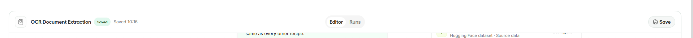

### 2.2. Điều hướng và Cảnh báo
- **Hierarchical Path:** Hiển thị đường dẫn bên cạnh nút quay về.
  - Nhấn vào "Recipes" để quay lại menu danh sách.
  - Nhấn vào biểu tượng "Trở về" để quay lại trang trước đó.
- **Cảnh báo thay đổi chưa lưu:** Nếu người dùng chuyển trang khi có thay đổi chưa lưu, hiển thị hộp thoại xác nhận:
  - *Nội dung:* "Các thay đổi chưa lưu sẽ bị mất. Bạn có chắc chắn muốn quay lại không? / Unsaved changes will be lost. Are you sure you want to go back?"
  - *Tùy chọn:* 
    - **Lưu** (Màu xanh)
    - **Không lưu** (Màu đỏ)
    - **Hủy** (Màu trung tính)

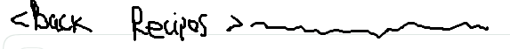

---

## 3. Giao diện bên trong Editor

### 3.1. Điều khiển Zoom (Góc trái dưới)
- Thay thế các nút +/- đơn giản bằng một thanh Zoom chuyên dụng.
- **Thành phần:**
  - Nút [-] và [+] ở hai đầu thanh slider.
  - Hiển thị tỷ lệ `% zoom` bằng văn bản.
  - Nút **Fit** (biểu tượng phóng to với 2 mũi tên).
  - Biểu tượng **Lock**: Khóa/mở khóa khả năng thay đổi đồ thị.

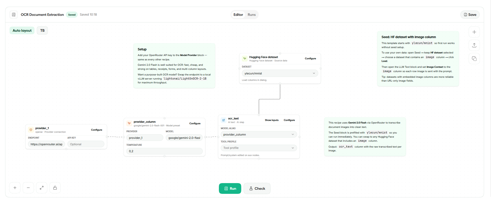
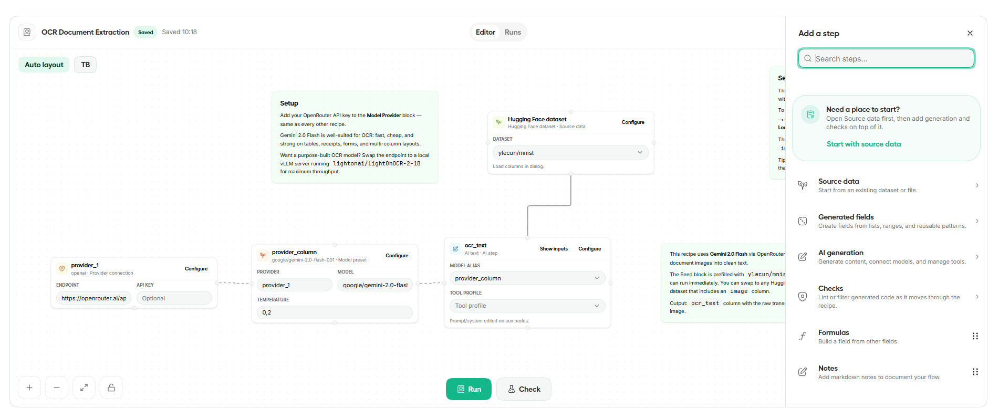

### 3.2. Kiểm tra tính hợp lệ (Validate - Góc trái trên)
- Hiển thị trạng thái của đồ thị hiện tại.
- **Trạng thái Lỗi/Cảnh báo:**
  - Hiển thị icon lỗi/warning kèm số lượng.
  - Khi click vào: Hiển thị danh sách lỗi chi tiết trong một box thả xuống.
  - Khi click vào từng lỗi: Tự động bôi đậm/focus vào Node tương ứng.
  - **Giao diện Node:** Node bị lỗi/cảnh báo sẽ có viền đỏ/vàng và icon cảnh báo bên trong.
- **Trạng thái Hợp lệ:**
  - Hiển thị icon Tích xanh.
  - Khi click vào: Hiển thị thông báo "No errors found" (có thể thêm minh họa sinh động).

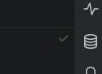
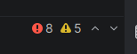

### 3.3. Thêm Node mới
- Phía bên phải có nút **[+]**.
- Khi click: Hiển thị danh sách các Node có sẵn dưới dạng *unpined dock* (không cần chia danh mục).

---

## 4. Đặc tả các loại Node

### 4.1. Đặc điểm chung của Node
- Chỉ hiển thị phần **Header** trên đồ thị chính (tương tự Unsloth nhưng lược bỏ phần cấu hình trực tiếp).
- Click vào Header của Node để mở giao diện cấu hình (Configuration) chi tiết.
- Các Node có thể thay đổi kích thước bằng chuột.
- Sử dụng **i18n Keys** cho toàn bộ văn bản (ví dụ: `recipes.recipe.name`).

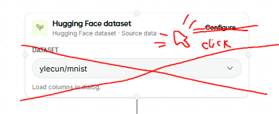

### 4.2. Comment Node
- Dùng để ghi chú trên đồ thị.
- Nội dung hỗ trợ định dạng **Markdown**.
- Không có phần Header cố định. Khi click vào thân node sẽ mở giao diện cấu hình nội dung.
- Không giới hạn chiều dài (không dùng thanh cuộn nếu nội dung quá dài, mở rộng node tương ứng).

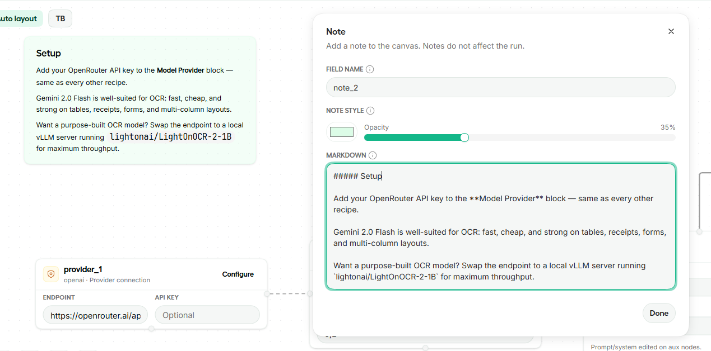
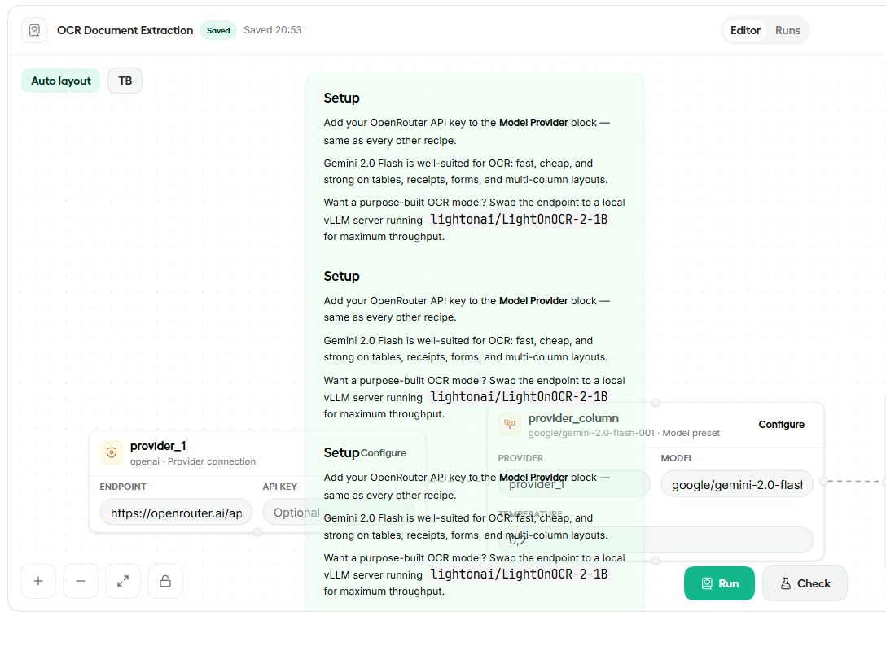

### 4.3. Workbook & Worksheet Node
- **Workbook Node:** Đại diện cho file Excel/CSV nguồn.
  - *Cấu hình:* File Path (kèm nút duyệt), Password (tùy chọn).
  - *Hành động:* Nút **Tải file** để phân tích cấu trúc file.
  - *Sau khi tải thành công:*
    - Hiển thị thông tin: Số sheet, Số cột, Số bản ghi.
    - Box chọn Sheet: Cho phép tick chọn các sheet cần dùng.
    - Header của box chọn hiển thị: Tổng số bản ghi (của các sheet đã chọn), nút "Chọn tất cả", và số lượng sheet đã chọn.
- **Worksheet Node (Node con):** Được tạo ra tự động sau khi chọn sheet từ Workbook.
  - Click vào để mở trang **Preview**.
  - *Giao diện Preview:*
    - Hiển thị đường dẫn Workbook gốc và tên Worksheet.
    - Bảng dữ liệu: Cố định Header row, hiển thị 20 dòng đầu tiên của dữ liệu.

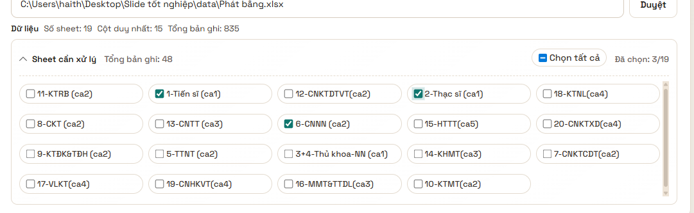
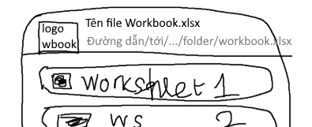
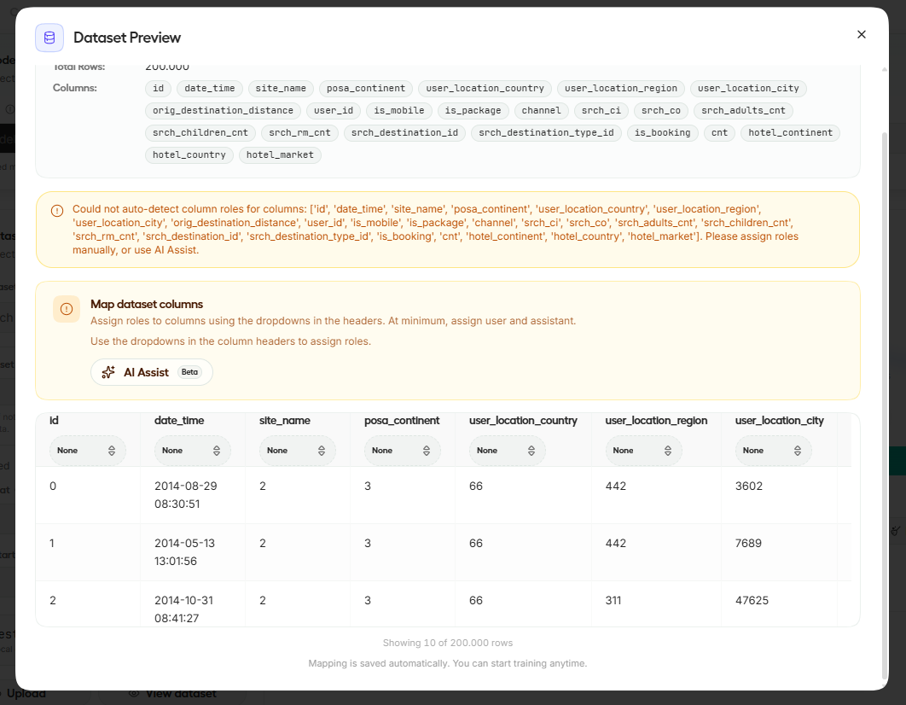
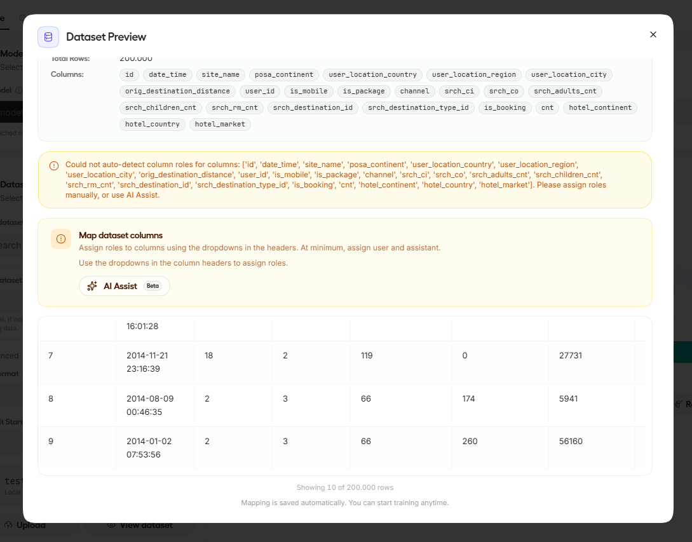
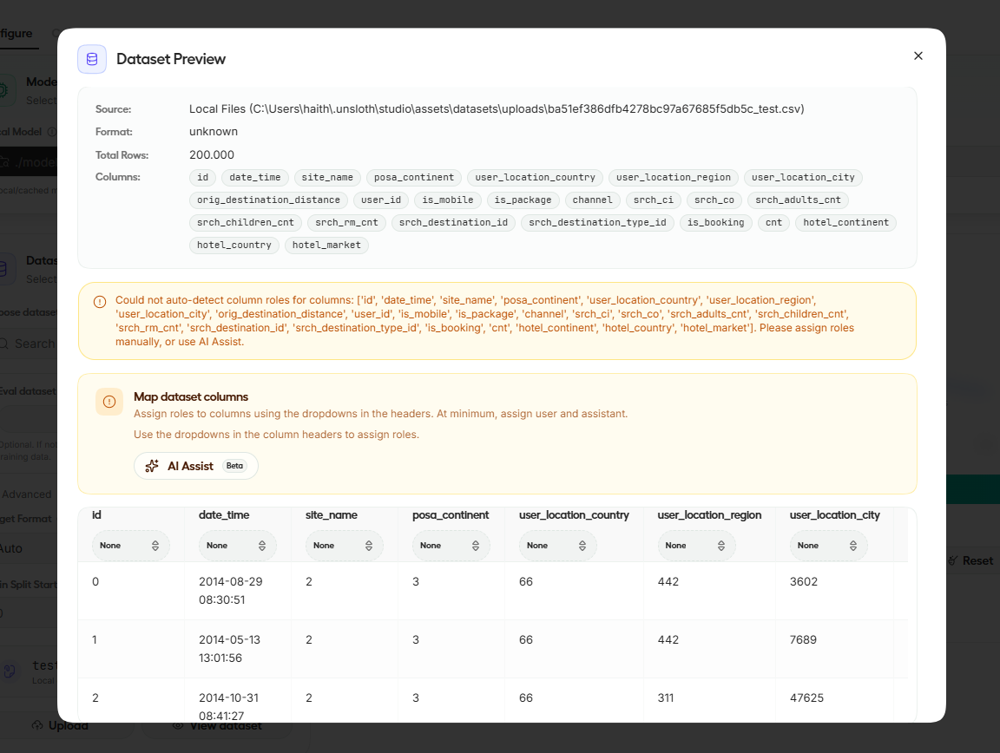

### 4.4. Presentation & Slide Node
- **Presentation Node:** Tương tự Workbook nhưng dành cho file PowerPoint.
  - Hiển thị: Tổng số Slide, Tổng số Placeholder, Tổng số Shape ảnh.
- **Slide Node (Node con):** 
  - *Giao diện Preview đặc biệt:*
    - Cho phép Zoom và kéo slide để xem chi tiết.
    - Hiển thị các vùng Placeholder với nhãn "TEXT" hoặc "IMAGE" (viết hoa).
    - Có nút [X] ở góc trên bên phải để đóng preview.

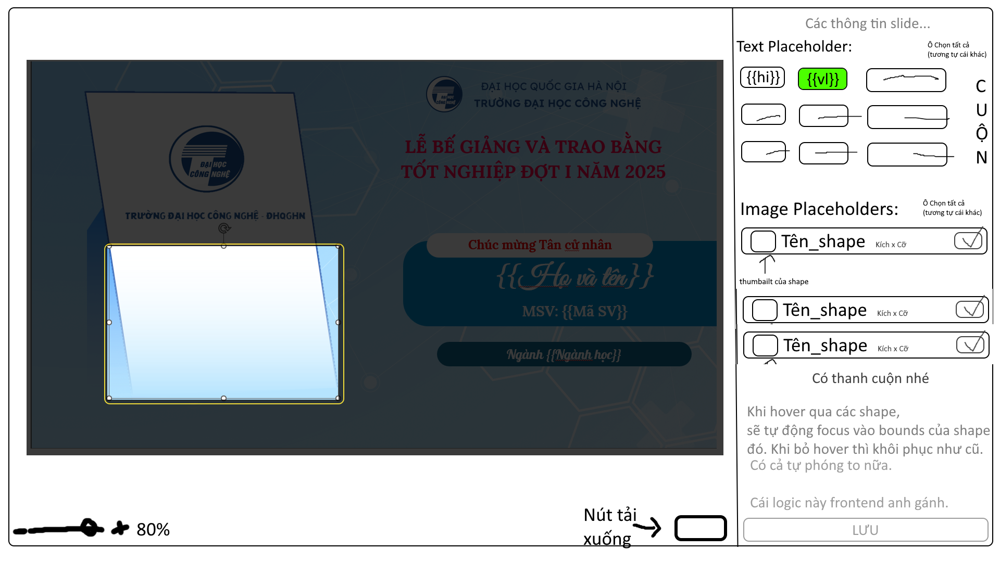
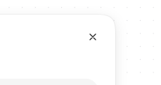
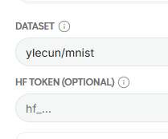

### 4.5. Map Node (Trung tâm điều phối)
- Kết nối giữa dữ liệu (Worksheet) và giao diện (Slide).
- **Quy tắc kết nối:**
  - Cạnh trái: Nhận input từ một hoặc nhiều Worksheet.
  - Cạnh phải: Kết nối tới duy nhất một Slide.
- **Thông tin hiển thị trên Node:**
  - Bên trái: Tổng số cột và số bản ghi từ Worksheet.
  - Bên phải: Số lượng Text và Image placeholder của Slide.
- **Giao diện cấu hình (Mapping):**
  - Danh sách cột dữ liệu (Màu xanh lá).
  - Danh sách placeholder (Màu đỏ).
  - Người dùng thực hiện map các cột dữ liệu tương ứng vào các placeholder.

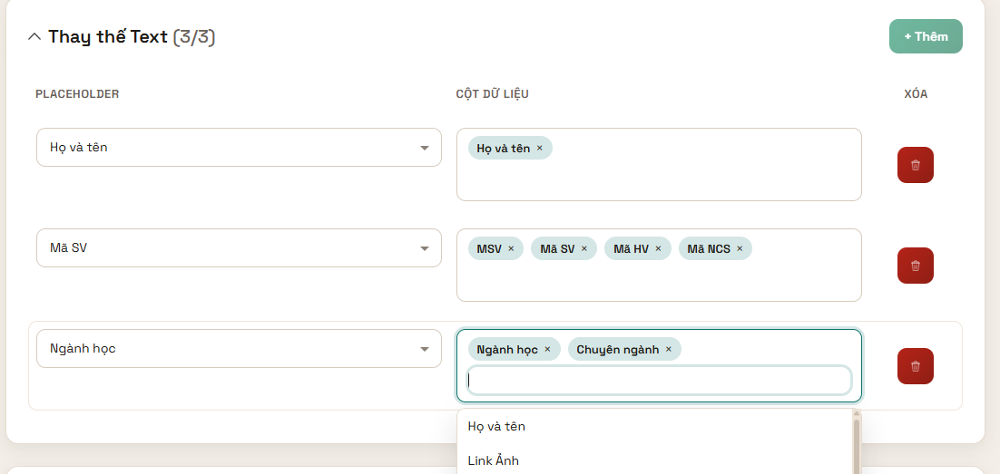

#### Cấu hình Hình ảnh (Image ROI Settings)
Nếu placeholder là hình ảnh, hiển thị menu cấu hình ROI (Region of Interest):
- **ROI Type:**
  - **Center:** Chỉnh tỷ lệ pivot (mặc định 1/2 x 1/2). Có tùy chọn `UseFaceAlignment` (Căn chỉnh theo khuôn mặt).
  - **RuleOfThirds:** Chỉnh tỷ lệ pivot (mặc định 1/2 x 1/3).
- **Tooltips minh họa:** Khi hover qua mỗi option khoảng 1s, hiển thị box giải thích gồm: Ảnh GIF minh họa, Tên kiểu và mô tả (tương tự gợi ý trong VS Code).

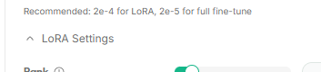
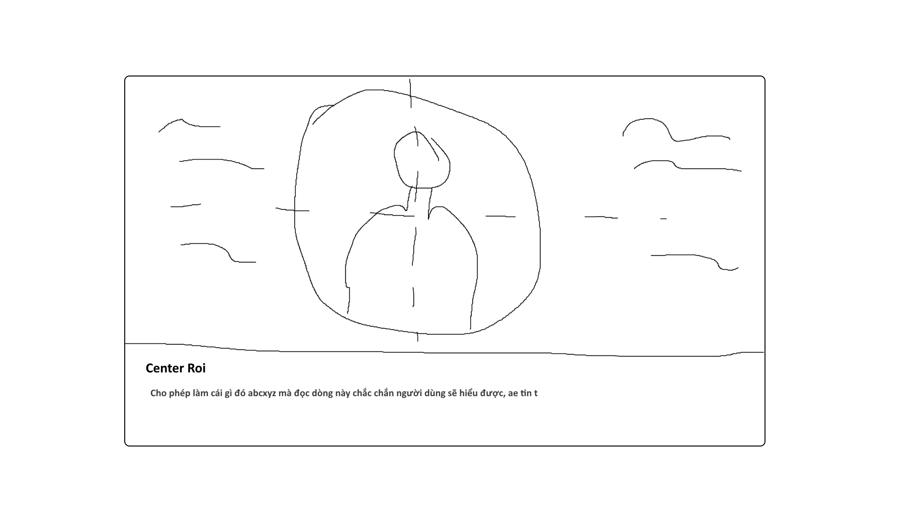

---

## 5. Yêu cầu kỹ thuật & UX
- **Kết nối (Wires):** Thiết kế đường nối mềm mại giữa các Node.
- **Phông nền (Background):** Sử dụng họa tiết chấm bi (dot pattern) tương tự Unsloth.
- **Đa ngôn ngữ (i18n):** Tuyệt đối không hardcode text. Sử dụng i18n keys cho mọi label và thông báo.
- **Chế độ Sáng/Tối (Dark/Light Mode):** Hỗ trợ chuyển đổi mượt mà với hiệu ứng animation.
- **Tương tác:** Cho phép thay đổi kích thước node và vị trí các thành phần linh hoạt.

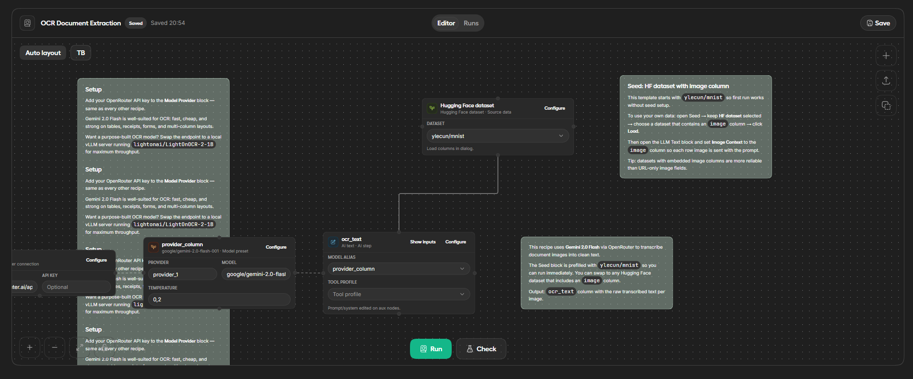
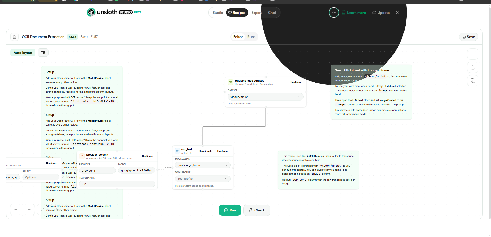
